# Тестування працездатності системи

Для перевірки працездатності використовувався застосунок Postman

## Role
### Post
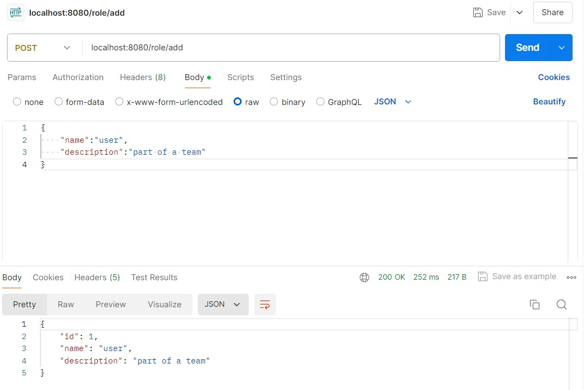

### Put
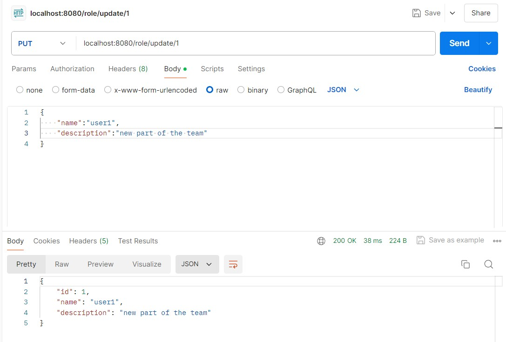

### Get (id)
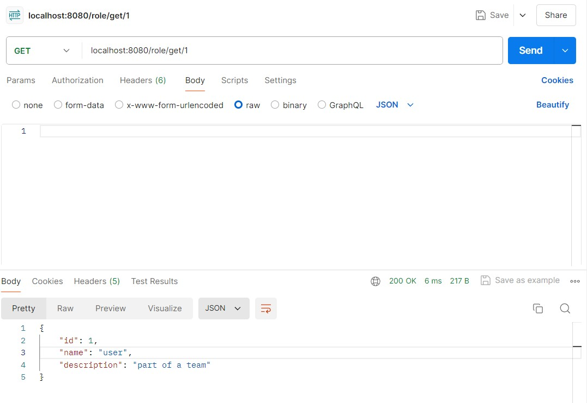

### Get (all)
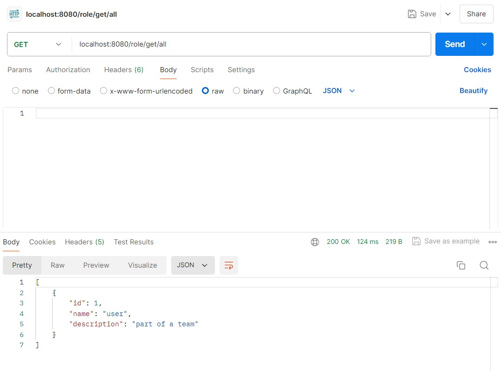

### Delete
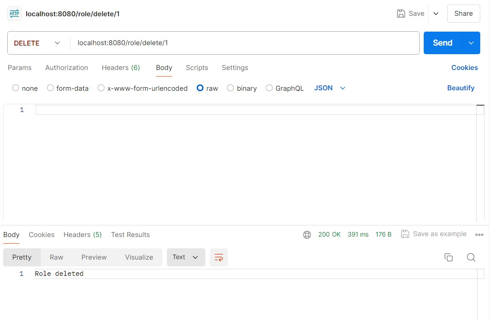

## Permission
### Post
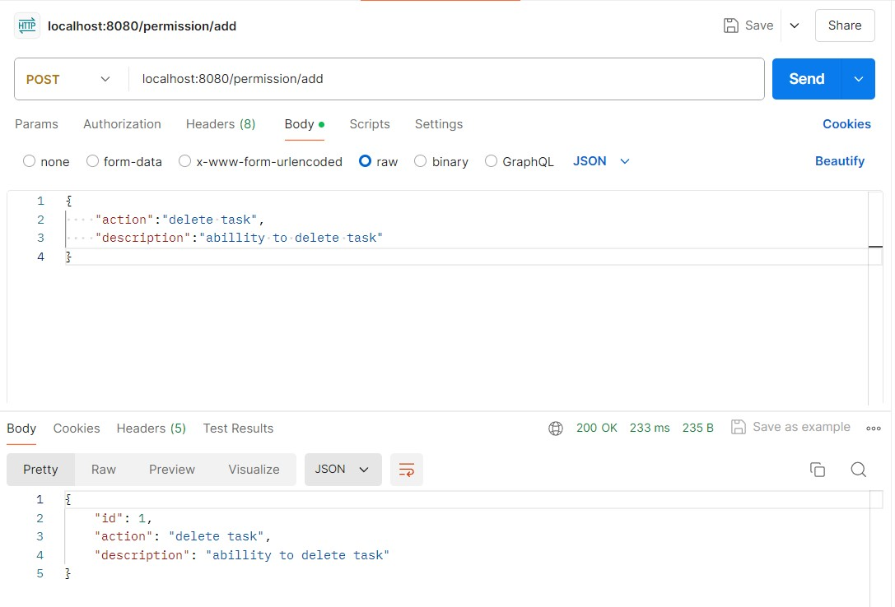

### Put
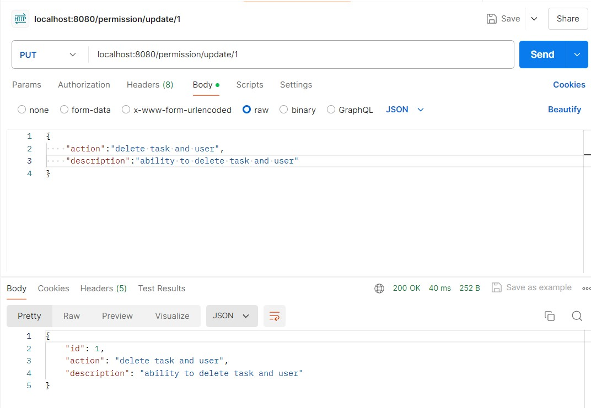

### Get (id)
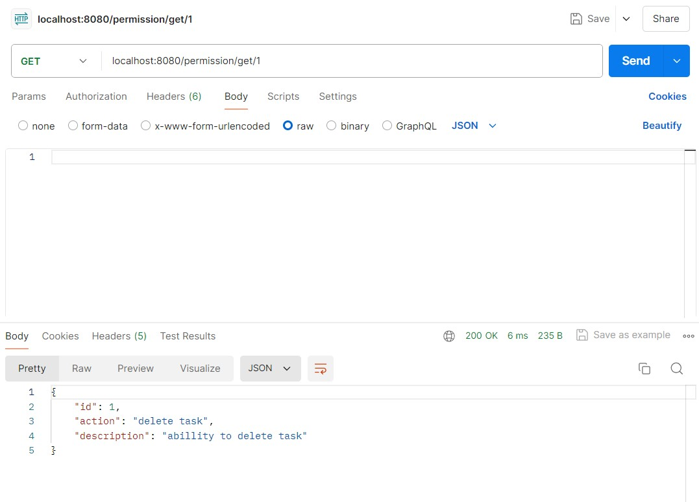

### Get (all)
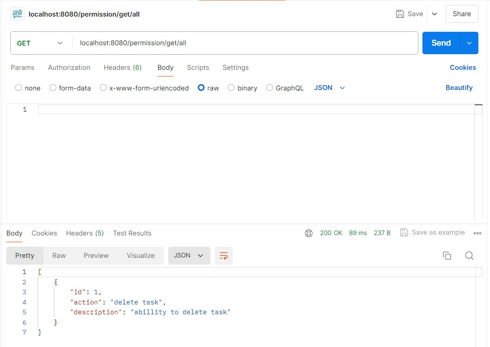

### Delete
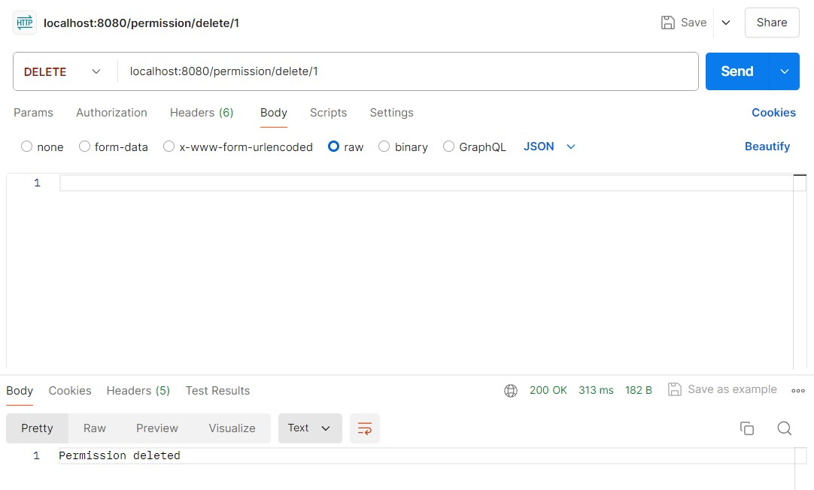

## Grant
### Post
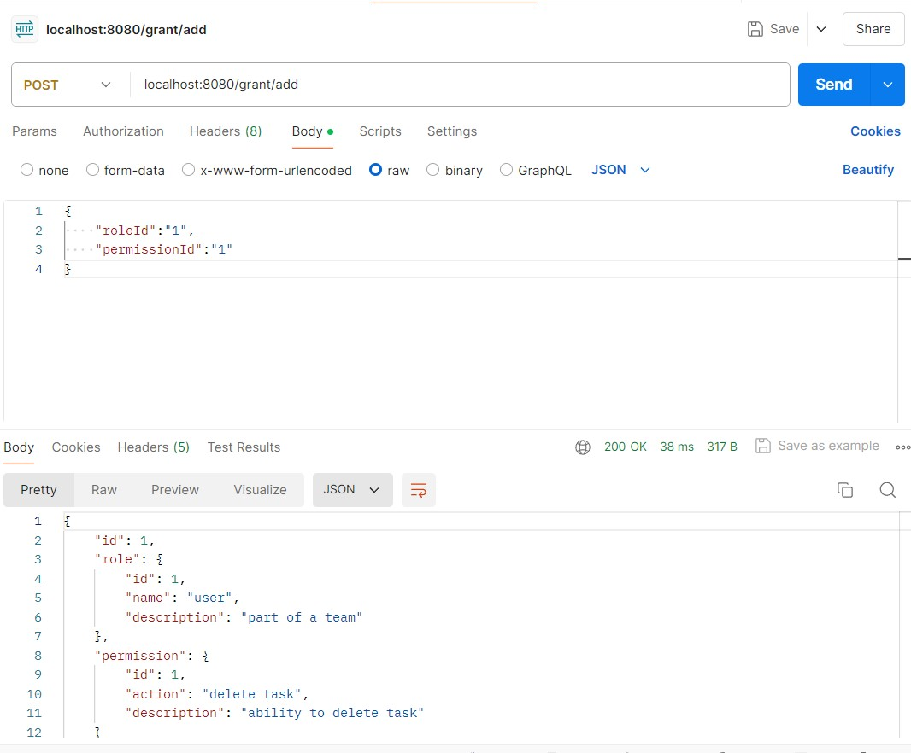

### Put
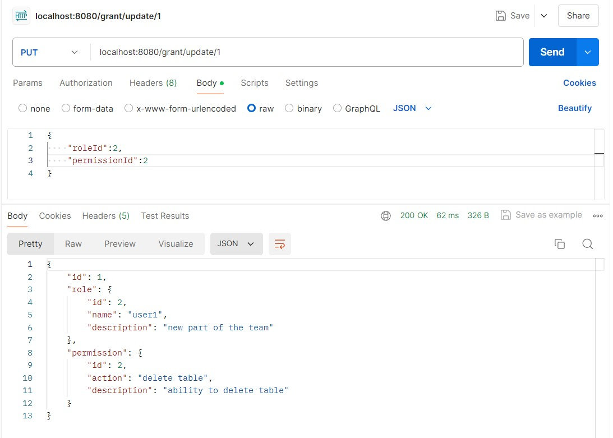

### Get (id)
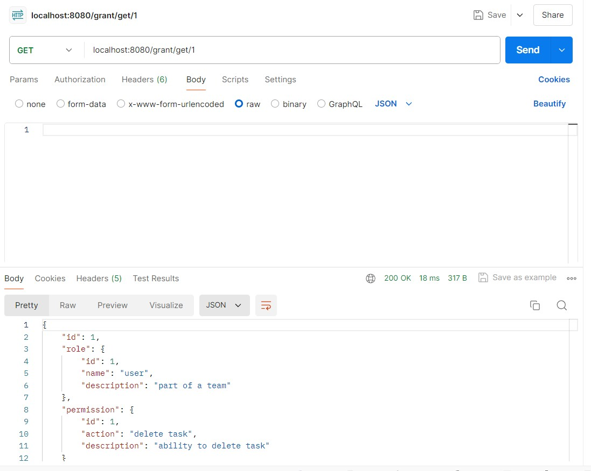

### Get (all)
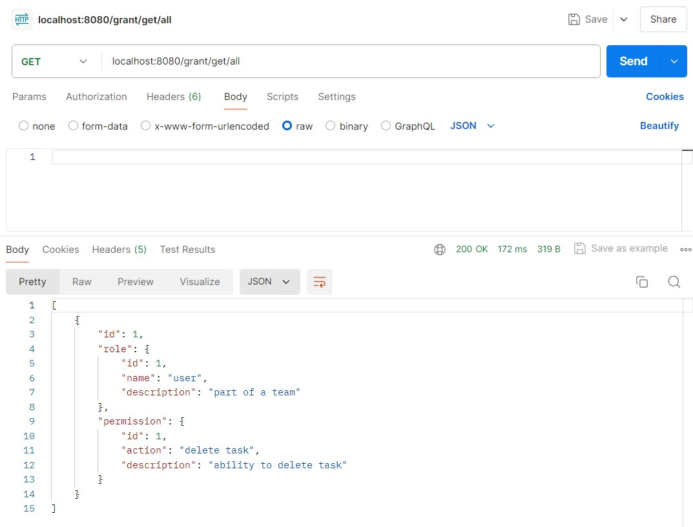

### Delete
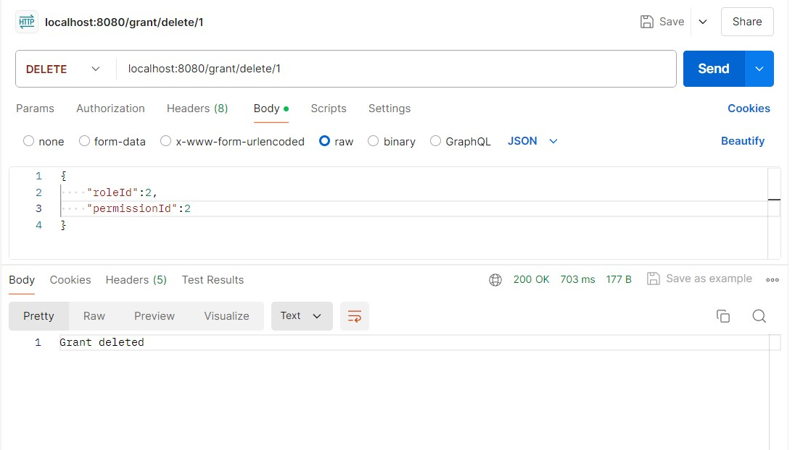
